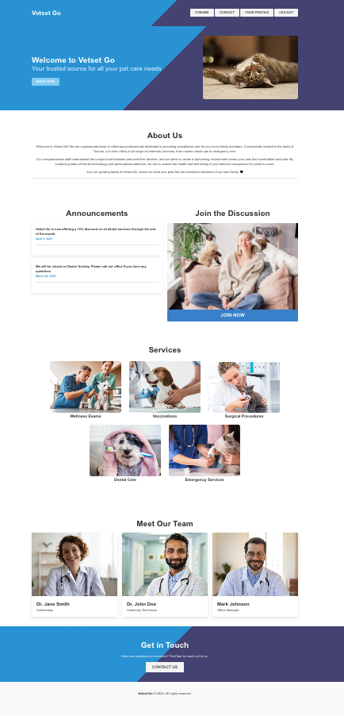
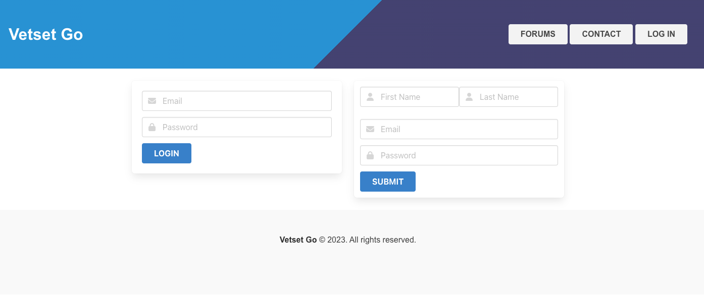
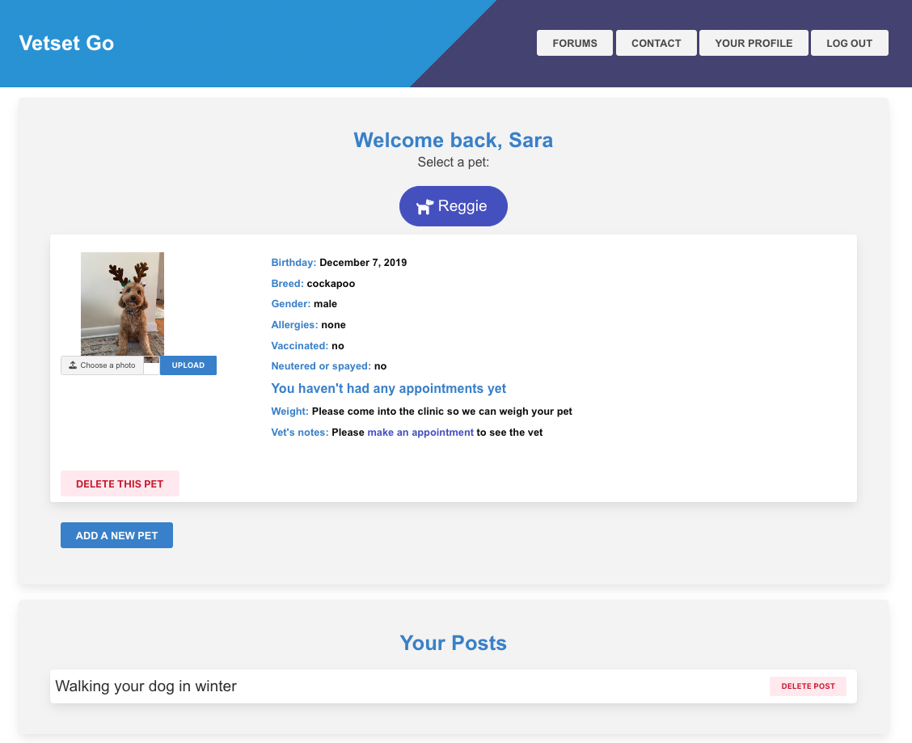
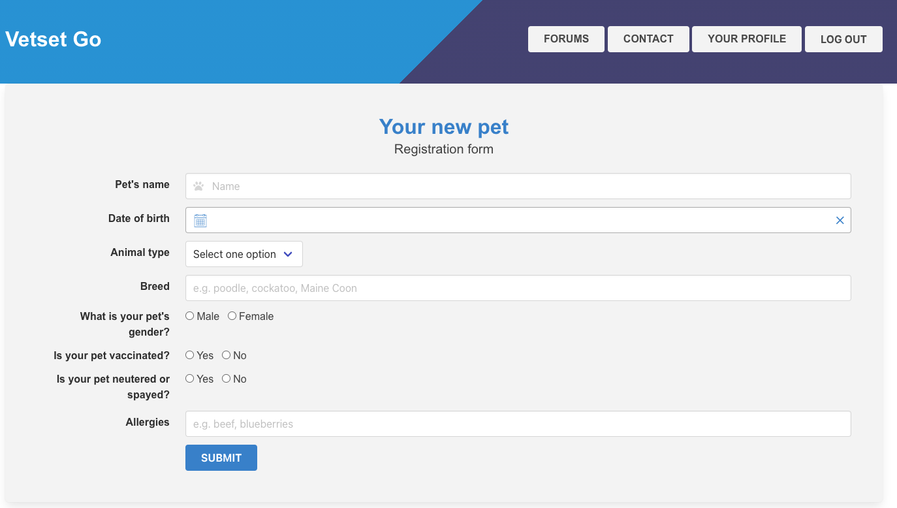
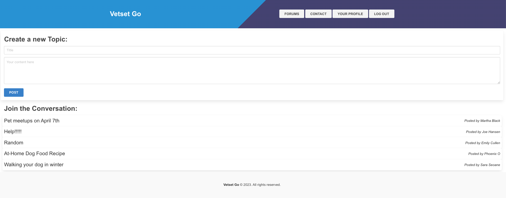
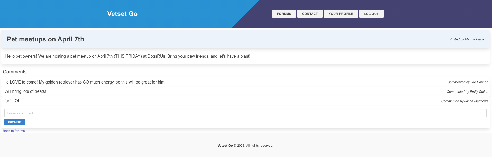
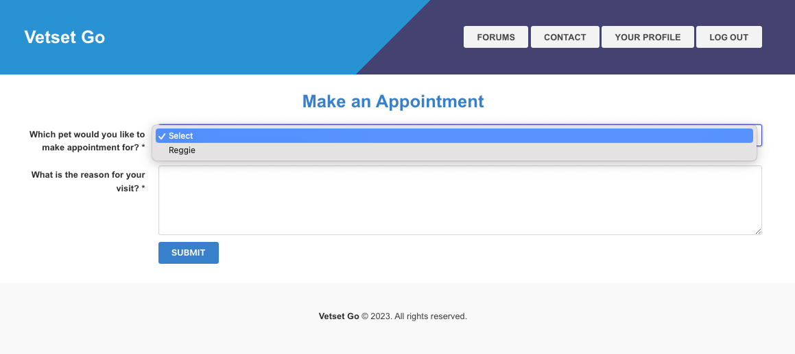
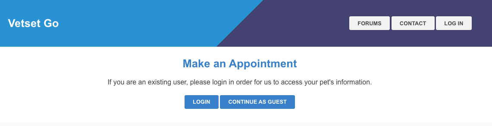
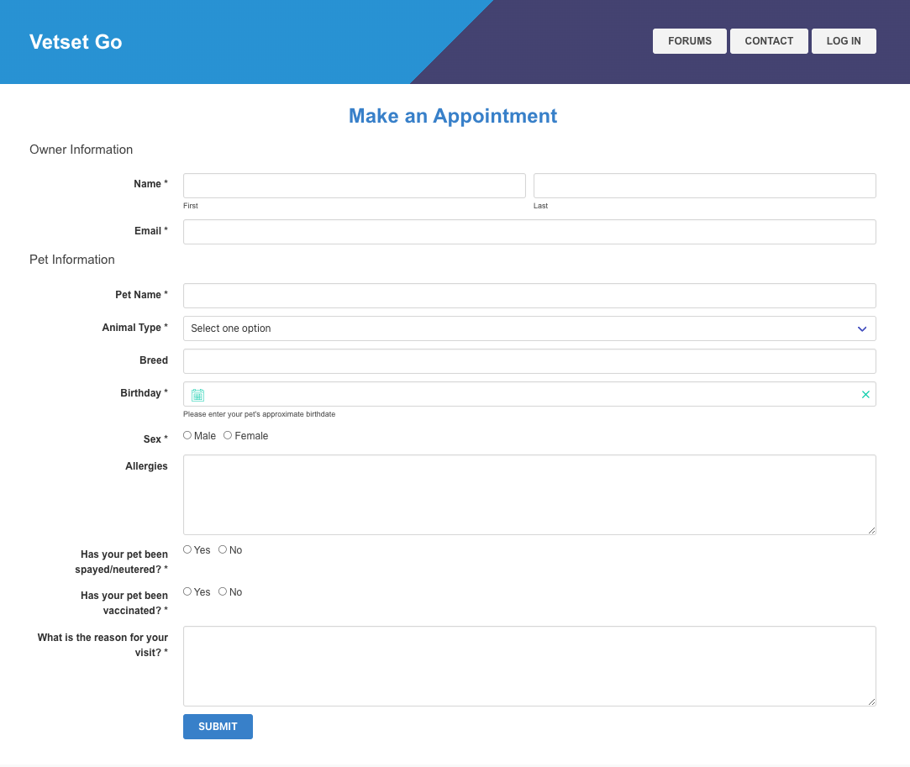
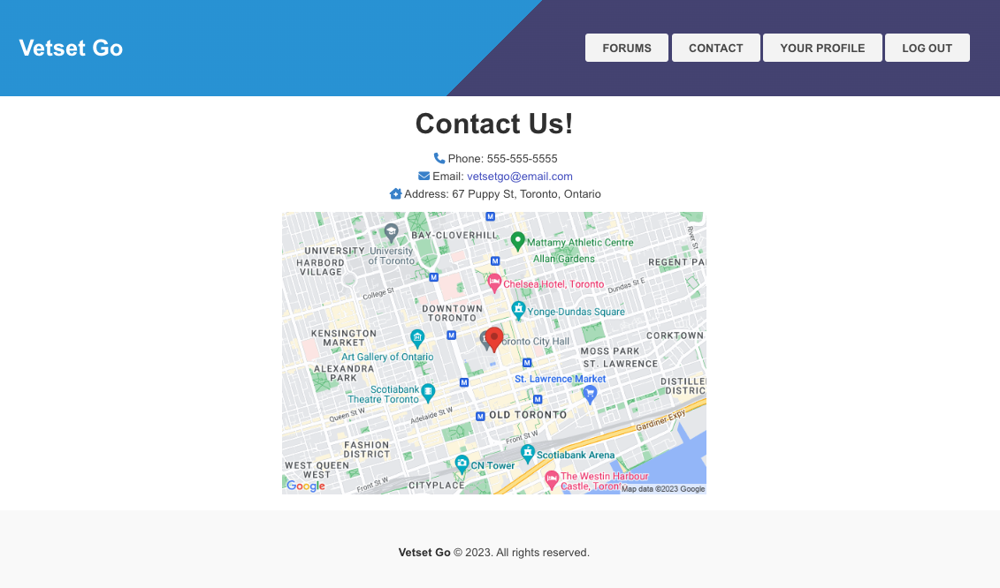

# Vet Set Go: veterinary clinic website


## Description

We have created a website for a veterinary clinic. The website allows users to create an account and add pet profiles to their account. Users can then view the pet records and vet's notes. Users can also book new appointments and participate in a Q&A forum.

We created this website because we want to help a veterinary clinic to provide a better service to their clients. We believe that having more interaction/ties between the clinic and the users will help the clinic grow whilst keeping a loyal customer base.

## Table of contents

- [Installation](#installation)
- [Usage](#usage)
- [Features](#features)
- [Screenshots](#screenshots)
- [Credits](#credits)
- [Feedback](#feedback)
- [License](#license)

## Installation

Ensure that you have Node.js installed, v16 is best. You can follow [this](https://coding-boot-camp.github.io/full-stack/nodejs/how-to-install-nodejs) guide for installation instructions.

Clone this repository to your local machine:

```bash
git clone git@github.com:Project2Group1/vet-set-go.git
```

Navigate to the root directory of the project and install the required dependencies:

```bash
cd ./vet-set-go
```

```bash
npm install
```

Create a .env file in the root directory and add your MySQL password using this format:

```.env
DB_NAME="vsg_db"
DB_USER="root"
DB_PASSWORD="your_password"
DB_HOST="127.0.0.1"
```

Create the database and tables using the schema.sql file:

```bash
mysql -u root -p
mysql> source ./db/schema.sql
```

Seed the database with some sample data:

```bash
npm run seed
```

Start the server:

```bash
npm start
```

Navigate to [http://localhost:3001/](http://localhost:3001/) in your browser to view the website.

## Usage

The application has been deployed to Heroku. You can view the website at [https://whispering-coast-03143.herokuapp.com/](https://whispering-coast-03143.herokuapp.com/)

## Features

- User can create an account
- User can add pet profiles to their account
- User can view pet records and vet's notes
- User can book new appointments
- User can participate in a Q&A forum

## Screenshots



Log in / Sign up page


User profile page


New pet page


Forum page



Appointment page for logged in users


Appointment page for non-logged in users



Contact us


## Credits

[Handlebars](https://handlebarsjs.com/) is used to generate the HTML for the website.

This page was styled using the [Bulma](https://bulma.io/) CSS framework. In addition to the basic Bulma framework, we used the [Calendar extension](https://wikiki.github.io/components/calendar/) to style the date pickers.

[This](https://github.com/richardgirges/express-fileupload/tree/master/example#basic-file-upload) tutorial and the NPM package express-fileupload helped us to implement the file upload feature.

The map on the contact page was made using the Google Maps Static API and help from [this](https://developers.google.com/maps/documentation/maps-static/start) tutorial.

NPM packages used:

- [bcrypt](https://www.npmjs.com/package/bcrypt)
- [connect-session-sequelize](https://www.npmjs.com/package/connect-session-sequelize)
- [dotenv](https://www.npmjs.com/package/dotenv)
- [express](https://www.npmjs.com/package/express)
- [express-fileupload](https://www.npmjs.com/package/express-fileupload)
- [express-handlebars](https://www.npmjs.com/package/express-handlebars)
- [express-session](https://www.npmjs.com/package/express-session)
- [mysql2](https://www.npmjs.com/package/mysql2)
- [sequelize](https://www.npmjs.com/package/sequelize)
- [uuid](https://www.npmjs.com/package/uuid)

## Feedback

If you have any questions about this project, please contact us at: project2.group1.bootcamp@gmail.com.

We welcome any feedback and suggestions for improvement. Please feel free to contact us at the above email address.

## License

Copyright 2023 Group 1.

Permission is hereby granted, free of charge, to any person obtaining a copy of this software and associated documentation files (the “Software”), to deal in the Software without restriction, including without limitation the rights to use, copy, modify, merge, publish, distribute, sublicense, and/or sell copies of the Software, and to permit persons to whom the Software is furnished to do so, subject to the following conditions:

The above copyright notice and this permission notice shall be included in all copies or substantial portions of the Software.

THE SOFTWARE IS PROVIDED “AS IS”, WITHOUT WARRANTY OF ANY KIND, EXPRESS OR IMPLIED, INCLUDING BUT NOT LIMITED TO THE WARRANTIES OF MERCHANTABILITY, FITNESS FOR A PARTICULAR PURPOSE AND NONINFRINGEMENT. IN NO EVENT SHALL THE AUTHORS OR COPYRIGHT HOLDERS BE LIABLE FOR ANY CLAIM, DAMAGES OR OTHER LIABILITY, WHETHER IN AN ACTION OF CONTRACT, TORT OR OTHERWISE, ARISING FROM, OUT OF OR IN CONNECTION WITH THE SOFTWARE OR THE USE OR OTHER DEALINGS IN THE SOFTWARE.
